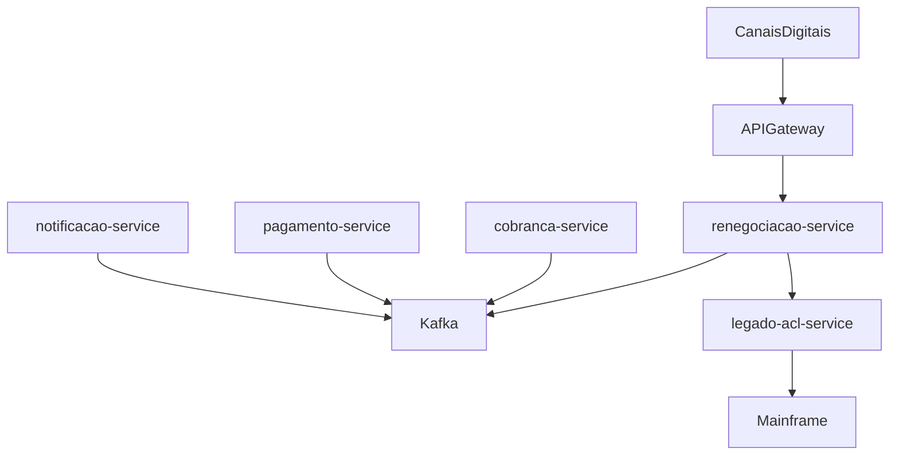

# Itaú Recuperação PJ — Modernização do sistema de renegociação

## Resumo executivo

Este repositório entrega uma **referência de modernização** da plataforma de recuperação de crédito **PJ** do Itaú: saída de um monólito mainframe em direção a **microsserviços orientados a eventos**, com coexistência controlada do legado e possibilidade de evolução incremental.

O desenho segue o padrão **Strangler Fig**: novas capacidades expõem APIs alinhadas ao domínio, publicam e consomem eventos em **Apache Kafka**, e isolam o contrato do mainframe por meio da **Anti-Corruption Layer (ACL)** (`legado-acl-service`). O fluxo de negócio central — consulta de dívidas, simulação, proposta, efetivação e acompanhamento — está materializado no **`renegociacao-service`**, com persistência em **PostgreSQL**, cache em **Redis** e integração assíncrona com os demais serviços.

**Objetivo para canais digitais:** permitir jornadas de renegociação com rastreabilidade, desacoplamento entre contextos (cobrança, pagamento, notificação) e **rollback** mais seguro do que no monólito único.

## Índice

- [Resumo executivo](#resumo-executivo)
- [Escopo da solução](#escopo-da-solução)
- [Arquitetura](#arquitetura)
- [Pré-requisitos](#pré-requisitos)
- [Código-fonte e clonagem](#código-fonte-e-clonagem)
- [Documentação adicional](#documentação-adicional)
- [Plano de apresentação (Itaú)](docs/plano-apresentacao-itau.md)
- [Como executar](#como-executar)
- [Checklist rápido de demonstração](#checklist-rápido-de-demonstração)
- [URLs úteis](#urls-úteis)
- [Endpoints principais](#endpoints-principais)
- [Qualidade e conformidade de build](#qualidade-e-conformidade-de-build)
- [Cobertura de testes](#cobertura-de-testes)
- [Padrões de projeto](#padrões-de-projeto)
- [Estrutura do repositório](#estrutura-do-repositório)
- [Tecnologias](#tecnologias)
- [Para avaliação Itaú](#para-avaliação-itaú)
- [Autor](#autor)

## Escopo da solução

| Módulo | Porta | Responsabilidade | Persistência / integração |
|--------|-------|------------------|---------------------------|
| **renegociacao-service** | 8082 | API principal: dívidas, simulação, propostas, efetivação; orquestração do domínio de renegociação | PostgreSQL, Redis (cache), Kafka |
| **cobranca-service** | 8081 | Contexto de cobrança: integração via eventos Kafka com o ecossistema | Kafka |
| **pagamento-service** | 8083 | Contexto de pagamentos (ex.: eventos de boleto): produção/consumo Kafka | Kafka |
| **notificacao-service** | 8084 | Notificações assíncronas a partir de eventos | Kafka (consumo) |
| **legado-acl-service** | 8085 | **Fronteira com o mainframe**: traduz contratos modernos ↔ legado (ACL) | APIs HTTP (sem banco próprio no módulo) |

> **Infraestrutura:** o [docker-compose.yml](docker-compose.yml) provisiona Kafka, Redis, Kafka UI e instâncias **PostgreSQL** separadas (incluindo bases para cobrança e pagamento), alinhadas ao padrão *database per service* para evolução futura dos respectivos serviços.

## Arquitetura

Visão lógica (canais → microsserviços → barramento → ACL → legado):

```
┌─────────────────┐
│ Canais digitais │
│ (App / Web / API)│
└────────┬────────┘
         │
         ▼
┌─────────────────┐
│   API Gateway   │
└────────┬────────┘
         │
         ▼
┌────────────────────────────────────────────────────────────────┐
│                     Microsserviços                             │
│  ┌──────────────────┐  ┌──────────────────┐                  │
│  │ renegociacao     │  │ cobranca         │                  │
│  │ service (8082)   │  │ service (8081)   │                  │
│  └────────┬─────────┘  └────────┬─────────┘                  │
│           │                     │                              │
│  ┌────────┴─────────┐  ┌────────┴─────────┐                  │
│  │ pagamento        │  │ notificacao      │                  │
│  │ service (8083)   │  │ service (8084)   │                  │
│  └────────┬─────────┘  └────────┬─────────┘                  │
└───────────┼─────────────────────┼────────────────────────────┘
            │                     │
            ▼                     ▼
┌──────────────────┐    ┌──────────────────┐
│  Apache Kafka    │    │ legado-acl-service│
│  (event bus)     │    │ (8085)            │
└──────────────────┘    └─────────┬───────────┘
                                  │
                                  ▼
                        ┌──────────────────┐
                        │ Mainframe        │
                        │ (sistema legado) │
                        └──────────────────┘

Armazenamento (renegociacao-service): PostgreSQL + Redis.
```

Fluxo de dependências em alto nível:



## Pré-requisitos

- **Java 17+** (recomendado: Eclipse Temurin)
- **Maven 3.8.6+** (exigido pelo Enforcer no POM raiz; recomenda-se Maven 3.9+)
- **Docker** e **Docker Compose**

## Código-fonte e clonagem

Repositório público de referência:

[https://github.com/reenanjoordan/itau-recuperacao-pj](https://github.com/reenanjoordan/itau-recuperacao-pj)

Clone e trabalhe **sempre** na pasta do projeto (`itau-recuperacao-pj`), não em um diretório do usuário onde possa existir outro `.git` sem relação com este repositório.

```bash
git clone https://github.com/reenanjoordan/itau-recuperacao-pj.git
cd itau-recuperacao-pj
```

Branch principal: **main**.

> Este repositório **não inclui** configuração de GitHub Actions: build e testes são reproduzíveis localmente com Maven e Docker (ver [Qualidade e conformidade de build](#qualidade-e-conformidade-de-build)).

## Documentação adicional

| Documento | Descrição |
|-----------|-----------|
| [docs/relatorio-tecnico.md](docs/relatorio-tecnico.md) | **Anexo técnico**: arquitetura detalhada, padrões, segurança, integrações e aprofundamentos para avaliação |
| [docs/plano-apresentacao-itau.md](docs/plano-apresentacao-itau.md) | Roteiro, mensagens-chave e checklist para apresentação ao Itaú |

## Como executar

### 1. Subir a infraestrutura (Kafka, PostgreSQL, Redis)

```bash
docker compose up -d
```

### 2. Compilar e executar os testes (reactor completo)

```bash
mvn clean verify
```

### 3. Executar o serviço de renegociação localmente

```bash
cd renegociacao-service
mvn spring-boot:run
```

### 4. Subir todos os serviços via Docker

```bash
# Primeiro, compilar os JARs de todos os módulos
mvn clean package -DskipTests

# Infraestrutura + microsserviços na mesma stack Compose (rede compartilhada)
docker compose -f docker-compose.yml -f docker-compose-services.yml up -d --build
```

## Checklist rápido de demonstração

1. **Infra:** `docker compose up -d` — aguardar health de Kafka e PostgreSQL.
2. **Build de confiança:** na raiz, `mvn clean verify`.
3. **API documentada:** com `renegociacao-service` em execução, abrir Swagger em [http://localhost:8082/swagger-ui.html](http://localhost:8082/swagger-ui.html).
4. **Saúde:** [http://localhost:8082/actuator/health](http://localhost:8082/actuator/health).
5. **Kafka UI:** [http://localhost:8090](http://localhost:8090) — observar tópicos (ex.: `renegociacao.proposta.criada`, `renegociacao.proposta.efetivada`, `cobranca.acao.realizada`, `pagamento.boleto.gerado` — ver comentários em [docker-compose.yml](docker-compose.yml)).
6. **Stack completa (opcional):** após `mvn clean package -DskipTests`, usar o segundo arquivo Compose conforme o passo 4 de [Como executar](#como-executar).

## URLs úteis

| Recurso | URL |
|---------|-----|
| Swagger UI (renegociação) | http://localhost:8082/swagger-ui.html |
| OpenAPI JSON | http://localhost:8082/v3/api-docs |
| Kafka UI | http://localhost:8090 |
| Actuator Health (renegociação) | http://localhost:8082/actuator/health |
| Actuator Metrics (renegociação) | http://localhost:8082/actuator/metrics |

## Endpoints principais

### renegociacao-service (porta 8082)

| Método | Endpoint | Descrição |
|--------|----------|-----------|
| `GET` | `/api/v1/renegociacao/dividas/{cpfCnpj}` | Consultar dívidas de um cliente PJ |
| `POST` | `/api/v1/renegociacao/simular` | Simular proposta de renegociação |
| `POST` | `/api/v1/renegociacao/proposta` | Criar proposta de renegociação |
| `POST` | `/api/v1/renegociacao/proposta/{id}/efetivar` | Efetivar proposta de renegociação |
| `GET` | `/api/v1/renegociacao/proposta/{id}` | Consultar proposta por ID |
| `DELETE` | `/api/v1/renegociacao/proposta/{id}` | Cancelar proposta |

## Qualidade e conformidade de build

O monorepo define práticas de build no [pom.xml](pom.xml) raiz, aplicáveis a todos os módulos:

| Ferramenta | Objetivo |
|------------|----------|
| **Maven Enforcer** | Garante **Java 17+** e **Maven 3.8.6+** em builds reproduzíveis |
| **SpotBugs** | Análise estática (bytecode) na fase `verify`, com *threshold* `High` e *fail* em erros |
| **CycloneDX** | Geração de **SBOM** agregado (`makeAggregateBom`) em JSON na fase `package`, para rastreabilidade de *supply chain* |

Execução típica na raiz: `mvn clean verify` (inclui testes e verificações agregadas do reactor).

## Cobertura de testes

O **JaCoCo** está configurado no **`renegociacao-service`**, com mínimo de **80%** de cobertura de instruções.

```bash
cd renegociacao-service
mvn clean verify
```

Relatório HTML: `renegociacao-service/target/site/jacoco/index.html`.

O projeto também utiliza **Testcontainers** em testes de integração onde aplicável (versão gerenciada no BOM do POM raiz).

## Padrões de projeto

| Padrão | Aplicação |
|--------|-----------|
| **Strangler Fig** | Migração gradual do monólito mainframe para microsserviços |
| **Anti-Corruption Layer (ACL)** | `legado-acl-service` traduz entre domínio moderno e legado |
| **CQRS** | Separação de comandos (escrita) e consultas (leitura) no serviço de renegociação |
| **Event sourcing (orientação)** | Eventos de domínio publicados via Kafka para rastreabilidade |
| **Saga** | Orquestração de transações distribuídas entre serviços |
| **Circuit Breaker** | Resilience4j em chamadas ao legado |
| **Strategy / Factory / Builder** | Regras de proposta, simulação e construção de objetos de domínio |
| **Repository** | Abstração de acesso a dados com Spring Data JPA (onde há persistência JPA) |
| **Database per service** | Bancos separados por contexto (infra preparada no Compose) |

## Estrutura do repositório

```
itau-recuperacao-pj/
├── pom.xml                          # POM pai (multi-módulo)
├── docker-compose.yml               # Infraestrutura (Kafka, PostgreSQL, Redis, Kafka UI)
├── docker-compose-services.yml     # Microsserviços adicionais (Compose overlay)
├── config/                          # Ex.: exclusões SpotBugs
├── docs/
│   └── relatorio-tecnico.md        # Anexo técnico para avaliação
├── renegociacao-service/
│   ├── pom.xml
│   ├── Dockerfile
│   └── src/
├── cobranca-service/
│   ├── pom.xml
│   ├── Dockerfile
│   └── src/
├── pagamento-service/
│   ├── pom.xml
│   ├── Dockerfile
│   └── src/
├── notificacao-service/
│   ├── pom.xml
│   ├── Dockerfile
│   └── src/
└── legado-acl-service/
    ├── pom.xml
    ├── Dockerfile
    └── src/
```

## Tecnologias

- **Java 17** com **Spring Boot 3.2.3**
- **Spring Data JPA** + **PostgreSQL 15** (serviço de renegociação)
- **Spring Data Redis** para cache
- **Apache Kafka** para comunicação assíncrona entre serviços
- **Resilience4j** (*circuit breaker* e *retry*)
- **Flyway** para versionamento de *schema*
- **MapStruct** para mapeamento DTO ↔ entidade
- **Lombok** para redução de *boilerplate*
- **SpringDoc OpenAPI** para documentação da API
- **JaCoCo** para cobertura de testes (módulo renegociação)
- **Testcontainers** para testes de integração
- **Docker** e **Docker Compose** para containerização

## Para avaliação Itaú

| Etapa | Ação |
|-------|------|
| Obter o código | Clonar a partir da seção [Código-fonte e clonagem](#código-fonte-e-clonagem); trabalhar na branch **main** |
| Reproduzir build | Na raiz do repositório: `mvn clean verify` |
| Inspecionar API | Subir infra + `renegociacao-service`; usar Swagger em `/swagger-ui.html` |
| Aprofundar arquitetura | Ler [docs/relatorio-tecnico.md](docs/relatorio-tecnico.md) |
| Observabilidade local | Actuator (`/actuator/health`, métricas) e Kafka UI (`8090`) conforme [URLs úteis](#urls-úteis) |

## Autor

Renan Jordão
