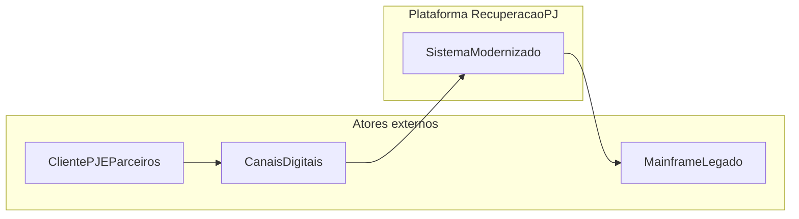
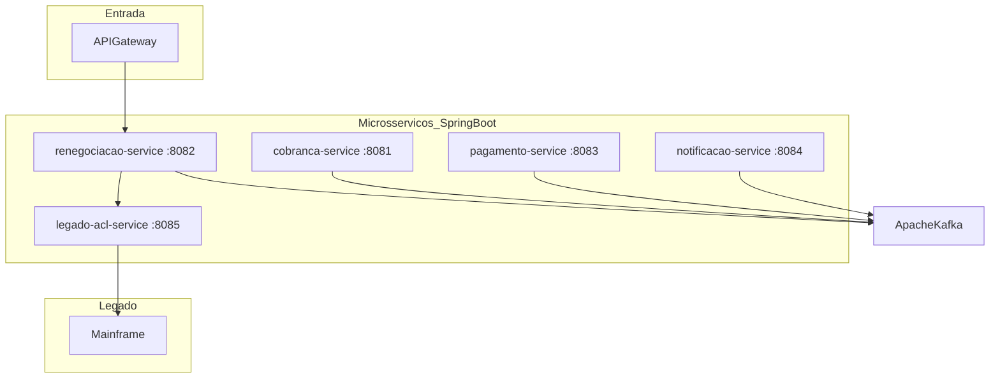
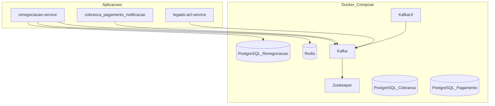
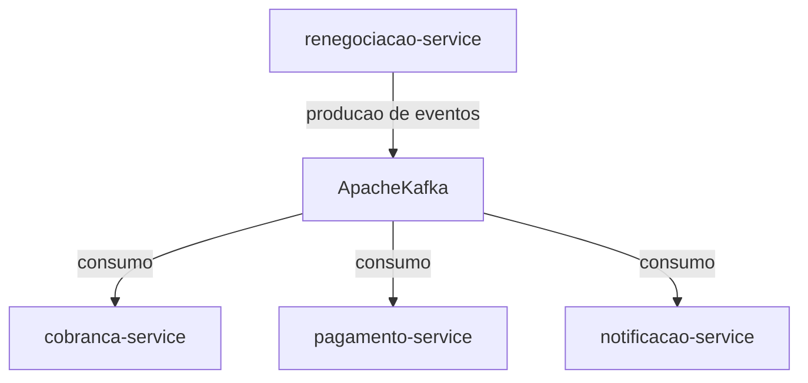
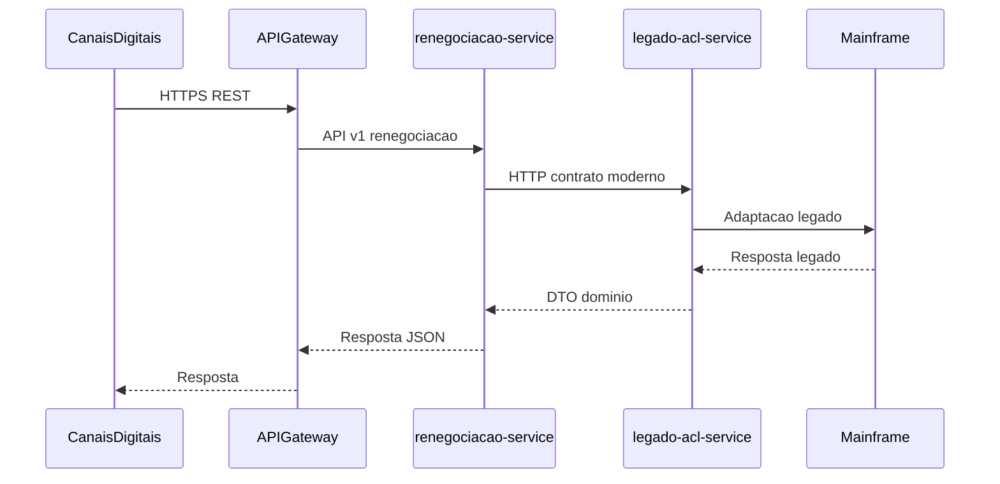

# Diagrama de arquitetura — apresentação Itaú

## 1. Visão de contexto (C4 — nível de sistema)

Quem interage com a solução e qual o papel do legado:

---

## 2. Contêineres e portas

Microsserviços, barramento de eventos e **Anti-Corruption Layer** frente ao mainframe:

**Persistência e integração (resumo):**

| Contêiner | Armazenamento / barramento |
|-----------|----------------------------|
| renegociacao-service | PostgreSQL, Redis, Kafka |
| cobranca-service | Kafka |
| pagamento-service | Kafka |
| notificacao-service | Kafka (consumo) |
| legado-acl-service | HTTP de adaptação (sem banco no módulo) |

---

## 3. Infraestrutura local (Docker Compose — visão lógica)

Base de dados por contexto e mensageria (alinhado a *database per service* na infra):

---

## 4. Integração assíncrona (Kafka)

O núcleo de renegociação **publica** eventos de domínio; cobrança, pagamento e notificação **consomem** conforme configuração de cada serviço:

**Tópicos** citados na documentação da infra (criação automática em ambiente local):

- `renegociacao.proposta.criada`
- `renegociacao.proposta.efetivada`
- `cobranca.acao.realizada`
- `pagamento.boleto.gerado`

---

## 5. Sequência simplificada — consulta via ACL

Leitura de dados sob responsabilidade do legado, com fronteira explícita:

